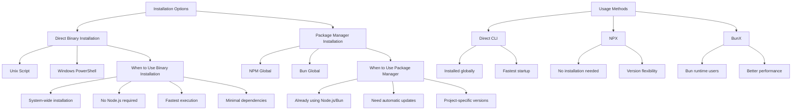

# @vj-presidio/specif-ai-mcp-server

A CLI tool that runs an MCP (Model Context Protocol) server over stdio for Specif-ai.

## Installation & Usage Overview



## Installation

### Direct Binary Installation (Recommended)

You can install the binary directly using our installation script:

```bash
# Unix (macOS/Linux)
curl -fsSL https://raw.githubusercontent.com/vj-presidio/specif-ai-mcp-server/main/install.sh | sh

# Install specific version
curl -fsSL https://raw.githubusercontent.com/vj-presidio/specif-ai-mcp-server/main/install.sh | sh -s -- -v 1.2.3
```

```powershell
# Windows (PowerShell)
iwr -useb https://raw.githubusercontent.com/vj-presidio/specif-ai-mcp-server/main/install.ps1 | iex

# Install specific version
iwr -useb https://raw.githubusercontent.com/vj-presidio/specif-ai-mcp-server/main/install.ps1 | iex -v 1.2.3
```

### Package Manager Installation

You can install globally using npm:

```bash
npm install -g @vj-presidio/specif-ai-mcp-server
```

Or using Bun:

```bash
bun install -g @vj-presidio/specif-ai-mcp-server
```

## Updates

To check for updates:

```bash
# Unix (macOS/Linux)
curl -fsSL https://raw.githubusercontent.com/vj-presidio/specif-ai-mcp-server/main/update.sh | sh -s -- -c

# Windows (PowerShell)
iwr -useb https://raw.githubusercontent.com/vj-presidio/specif-ai-mcp-server/main/update.ps1 | iex -c
```

To update to the latest version:

```bash
# Unix (macOS/Linux)
curl -fsSL https://raw.githubusercontent.com/vj-presidio/specif-ai-mcp-server/main/update.sh | sh

# Windows (PowerShell)
iwr -useb https://raw.githubusercontent.com/vj-presidio/specif-ai-mcp-server/main/update.ps1 | iex
```

To update to a specific version:

```bash
# Unix (macOS/Linux)
curl -fsSL https://raw.githubusercontent.com/vj-presidio/specif-ai-mcp-server/main/update.sh | sh -s -- -v 1.2.3

# Windows (PowerShell)
iwr -useb https://raw.githubusercontent.com/vj-presidio/specif-ai-mcp-server/main/update.ps1 | iex -v 1.2.3
```

## Usage

You can run the CLI directly if installed:

```bash
specif-ai-mcp-server
```

Or use it without installation via npx:

```bash
npx specif-ai-mcp-server
```

Or via bunx:

```bash
bunx specif-ai-mcp-server
```

### Options

- `--help`, `-h`: Display help information
- `--version`: Display version information

### Setting Project Path

Once the server is running, you can set the project path using the `set-project-path` tool. This tool accepts a path to the directory containing your specification files. After setting the path, the server will load all documents from that directory.

Example tool usage:

```json
{
  "name": "set-project-path",
  "arguments": {
    "path": "./path/to/project"
  }
}
```

### Available Tools

The server provides several tools for interacting with your specification documents:

| Tool Name          | Description                              |
| ------------------ | ---------------------------------------- |
| `set-project-path` | Set or change the project directory path |
| `get-brds`         | Get Business Requirement Documents       |
| `get-prds`         | Get Product Requirement Documents        |
| `get-nfrs`         | Get Non-Functional Requirements          |
| `get-uirs`         | Get User Interface Requirements          |
| `get-bps`          | Get Business Process Documents           |
| `get-user-stories` | Get User Stories for a specific PRD      |
| `get-tasks`        | Get Tasks for a specific User Story      |
| `get-task`         | Get details of a specific Task           |

## Requirements

For binary installation:

- curl (Unix) or PowerShell (Windows)
- sudo access (Unix, for system-wide installation)

For package manager installation:

- Node.js >= 16.0.0
- Bun >= 1.0.0 (if using Bun runtime)

## License

MIT
