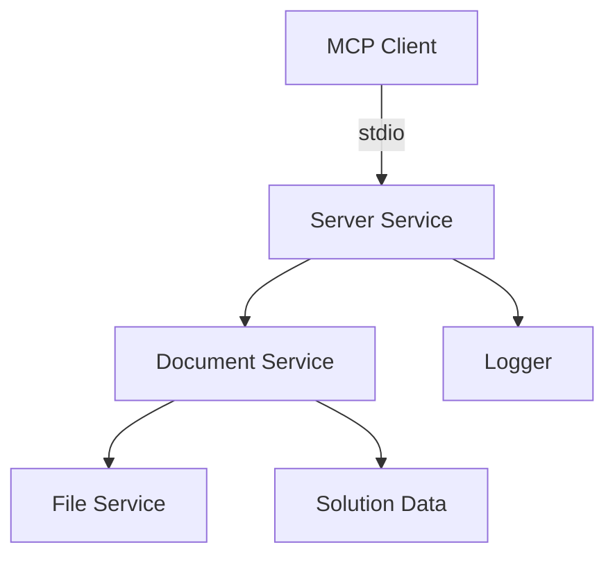
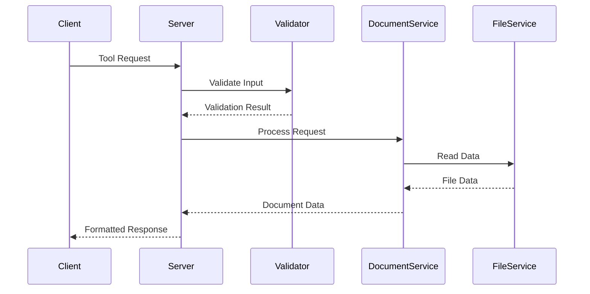
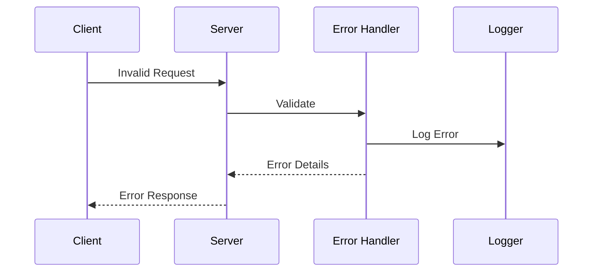

# Architecture Guide

## System Overview

The Specif-ai MCP Server implements the Model Context Protocol (MCP) over stdio, providing a standardized interface for managing requirement documents. The system follows a service-oriented architecture with clear separation of concerns.

## Core Components

### 1. Server Service (`server.service.ts`)

- Main entry point for MCP protocol implementation
- Handles tool registration and execution
- Manages request/response flow
- Implements stdio transport layer
- Key responsibilities:
  - Tool registration
  - Request validation
  - Response formatting
  - Error handling
  - Session management

### 2. Document Service (`document.service.ts`)

- Manages document operations
- Handles document loading and parsing
- Provides document search and retrieval
- Key responsibilities:
  - Solution loading
  - Document type management
  - Document search
  - Data validation

### 3. File Service (`file.service.ts`)

- Handles file system operations
- Manages file reading and writing
- Implements file system abstractions
- Key responsibilities:
  - File reading
  - Directory scanning
  - Path resolution
  - Error handling

## Data Flow

1. **Request Processing**

2. **Error Handling**

