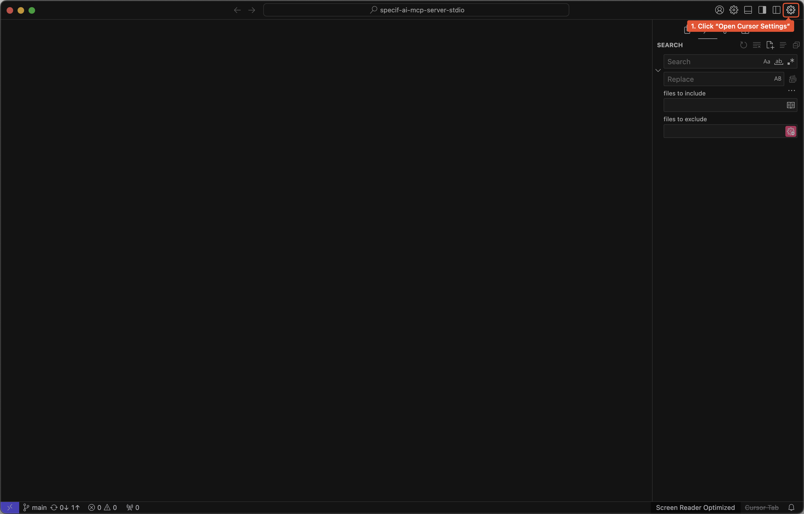
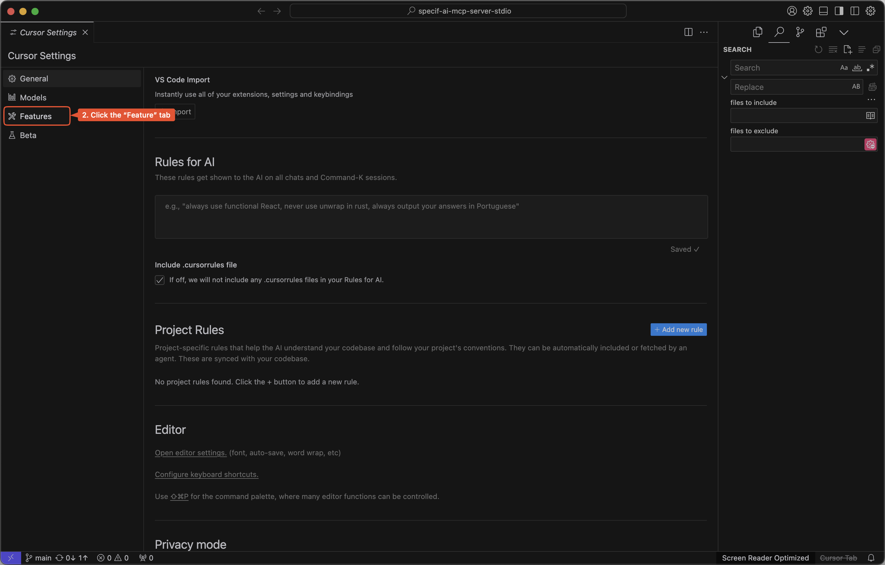
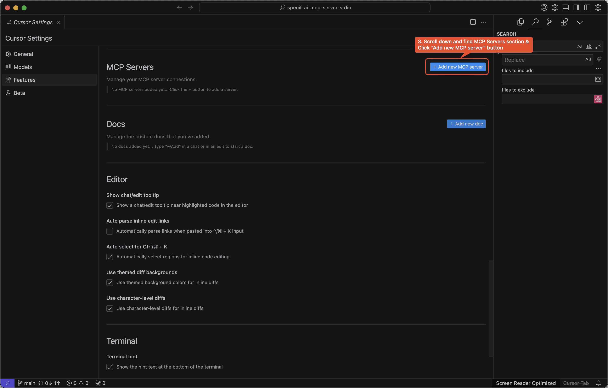
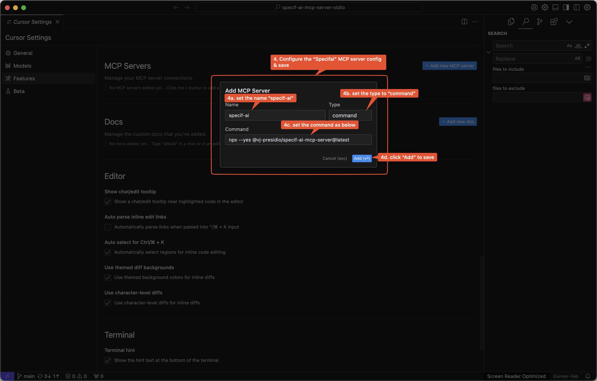
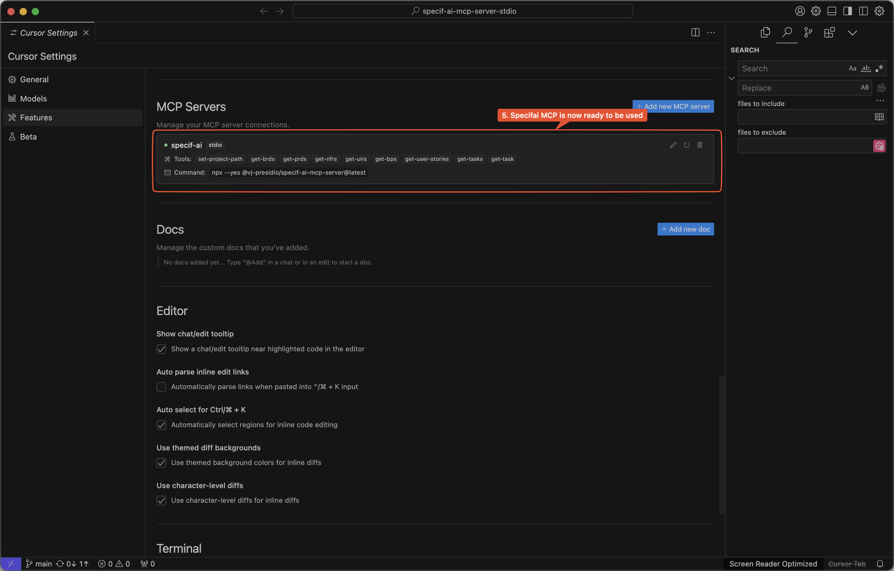

# Cursor Setup

## Step 1

Click the "Open cursor Settings" button. in the "Cursor" app from top right corner.

## Step 2

Click the "Features" tab from the left tab list on the settings page.

## Step 3

On the "Features" settings page, Scroll down and find the "MCP Servers" section and click "Add new MCP server" button.

## Step 4

On the configuration dialog, set the name to "specifai" and change Type to "Command" on the command input field set the values like below. see more examples config in [README.md](../../README.md) and Click "Add" button to save the configuration and add the server to the list.

## Step 5

The "Specifai" MCP server should now be available in the MCP servers list and can be used in your workflows.
