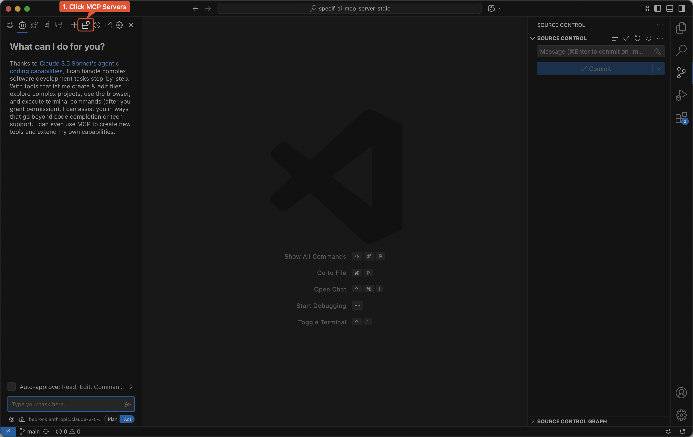
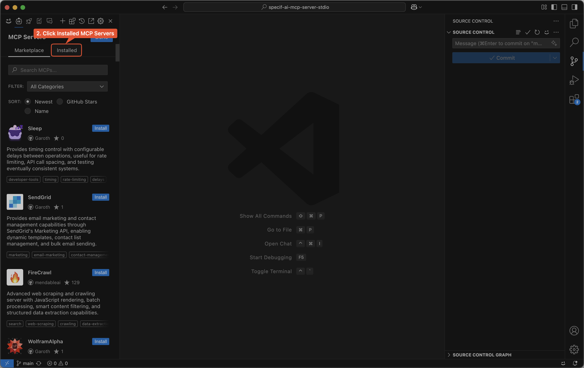
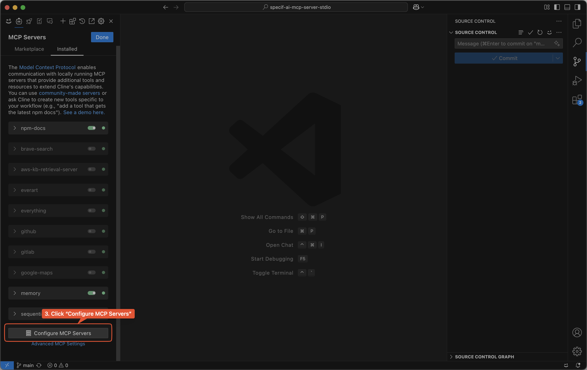
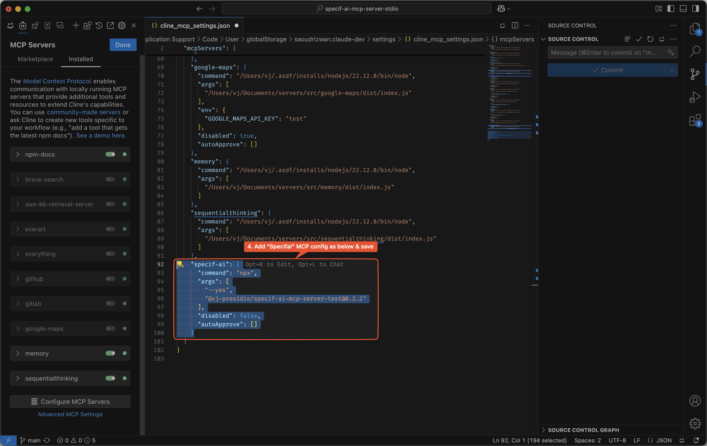
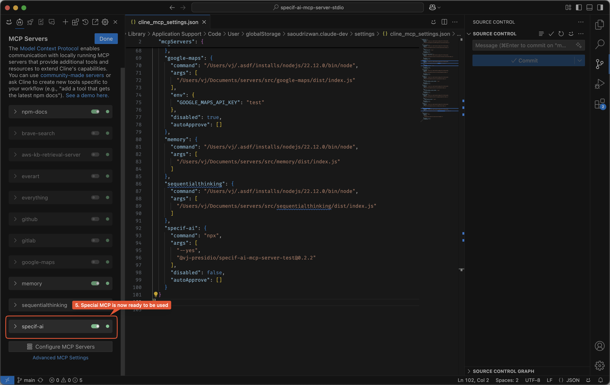

# Cline Setup

## Step 1

Click the "MCP Servers" icon from the extensions menu bar.

## Step 2

Navigate to the "installed" MCP servers tab.

## Step 3

Click the "Configure MCP Servers" button to add the "Specifai" MCP server.

## Step 4

Enter the "Specifai" MCP server config options and save. see example config in [README.md](../../README.md).

## Step 5

The "Specifai" MCP server should now be available in the MCP servers list and can be used in your workflows.
